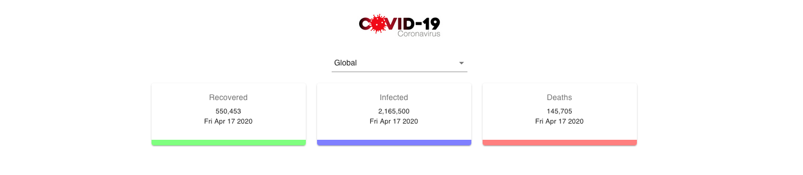

# covid19

This project is made on React - Redux with hooks. It shows the global data of covid-19 patients recovered, deaths and infected.
It has a dropdown to see the data according to the country.

